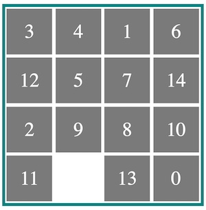
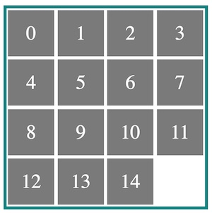

# CSCI 2254 Web App Development

## Problem Set 3: The Fifteen Puzzle

#### (10 Points) Due via GitHub push: Tuesday February 21, 11:59PM.

---

This problem set involves writing JavaScript code that interacts with the DOM and with Events. You can find information on the DOM and on Events on the [Mozilla Development Network](https://developer.mozilla.org/en-US/docs/Web/API/Document_Object_Model). In solving this problem, you're required to implement the Fifteen puzzle. The fifteen puzzle requires the solver to rearrange tiles to place them in order.

​                            

Your implementation should allow a user to click on a tile adjacent to the hole. When the tile is clicked, it should swap positions with the hole. If the user clicks a tile that is not adjacent to the hole, nothing should happen. When the user has arranged the tiles in order (ascending or descending, your choice) your  implementation should use an alert to congratulate them.

1. **Extra Credit** (1 Point): Animate the move of the tile in filling the hole.
2. **Extra Credit** (1 Point): Include a solve button that will cause your application to solve the puzzle, move by move.

Notes:

+ You are free to design the UI as you see fit,.
+ There are many solutions to this problem on the web; don't read them.
+ Submit your code in the usual way by pushing your repository to the GitHub site.